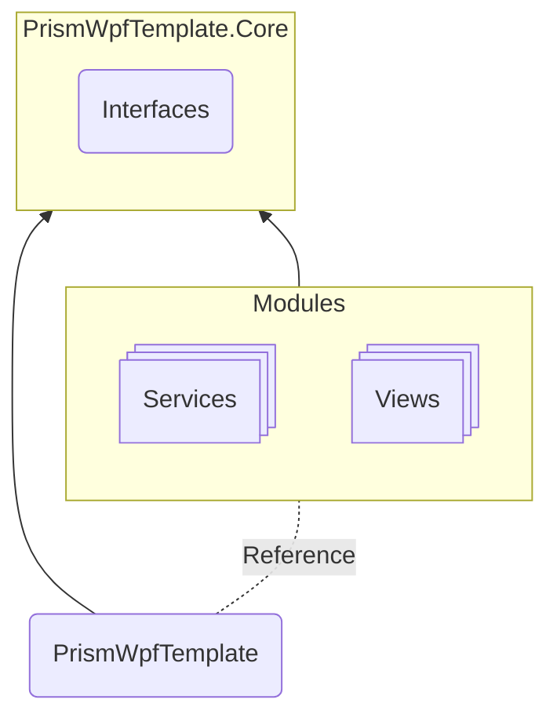

# PrismWpfTemplate

```mermaid
flowchart BT
  subgraph s1["PrismWpfTemplate.Core"]
    n1("Interfaces")
  end
  subgraph s2["Modules"]
    n2("Services")@{ shape: procs}
    n3("Views")@{ shape: procs}
  end
  n4("PrismWpfTemplate")
  n4 & s2 --> s1
  n4 -. Reference .- s2
```
